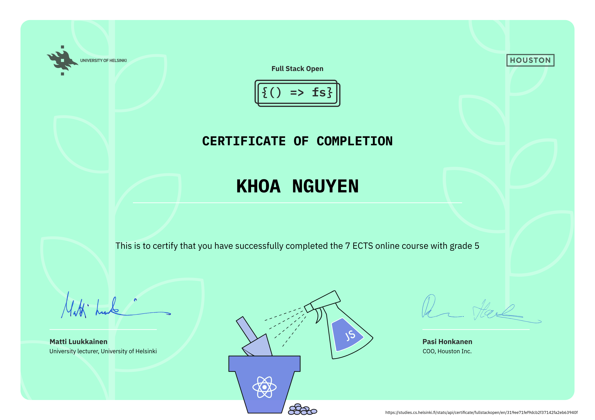
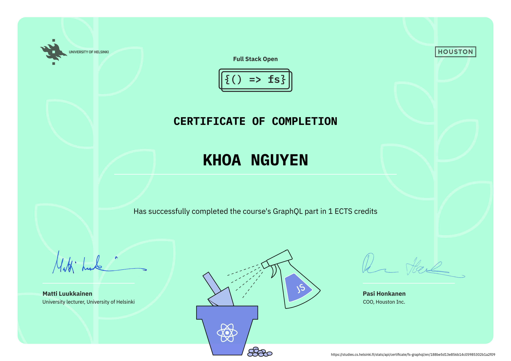

# fullstackopen

This repository contains my completed projects and exercises from the [FullStackOpen course](https://fullstackopen.com/en/), which provides an introduction to modern web development with JavaScript.

The course covers topics such as React, Redux, Node.js, MongoDB, GraphQL and TypeScript, and much more. The main focus is on building single page applications with ReactJS that use REST APIs built with Node.js.

## Course Material

The FullStackOpen course is divided into several parts, which include the following main topics:

- **Part 0**: Fundamentals of Web apps
- **Part 1**: Introduction to React
- **Part 2**: Communicating with server
- **Part 3**: Programming a server with NodeJS and Express
- **Part 4**: Testing Express servers, user administration
- **Part 5**: Testing React apps
- **Part 6**: Advanced state management
- **Part 7**: React router, custom hooks, styling app with CSS and webpack
- **Part 8**: GraphQL
- **Part 9**: TypeScript
- **Part 10**: React Native
- **Part 11**: CI/CD
- **Part 12**: Containers
- **Part 13**: Using relational databases

## Certificates

I have completed the following parts and received certificates which are also available in the `certificates/` folder:

- **Full Stack Certificate**: 

- **GraphQL Certificate**: 

- **TypeScript Certificate**: 

